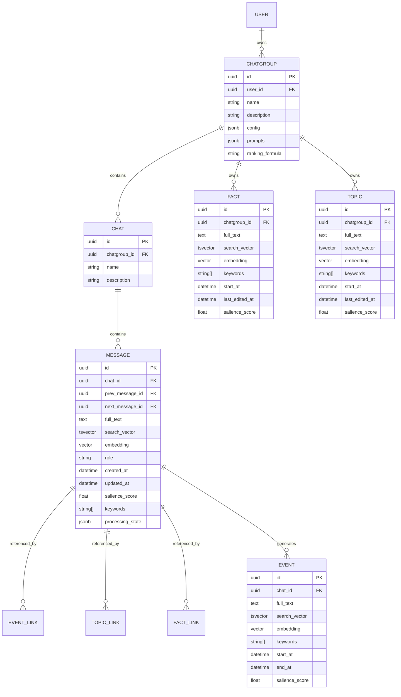

# Vistui Data Model

## Context

This document defines the core entities for the Vistui memory system. It is derived from the object hierarchy described in `startingpoint.md` and refined by the scope decisions captured in `system-overview.md`.

Key design rules:

- **ChatGroup** owns configuration, prompts, ranking formula, facts, and topics.
- **Chat** belongs to exactly one ChatGroup and owns messages and events.
- **Message** belongs to a Chat and is stored as a linked list.
- **Event**, **Topic**, and **Fact** are consolidated memory objects, each with embedding, keywords, salience score, and links to messages.
- **Embedding** and **salience score** are prerequisite fields for all messages; a separate batch pipeline ensures they are computed even for protected (recent) messages.

## Entity relationship diagram



## Entities

### User

Represents a human user of the system.

| Field | Type | Notes |
|-------|------|-------|
| `id` | UUID | Primary key, generated by the database. |
| `name` | string | Display name. |
| `email` | string | Optional, unique if present. |
| `created_at` | datetime | Automatic. |

### ChatGroup

A grouping created by a user to hold shared memory across one or more chats. It is the primary unit of memory scoping and configuration.

| Field | Type | Notes |
|-------|------|-------|
| `id` | UUID | Primary key. |
| `user_id` | UUID | Foreign key to User. |
| `name` | string | Display name. |
| `description` | string | Optional summary. |
| `config` | JSONB | All tunable settings (see below). |
| `prompts` | JSONB | Prompt templates stored as strings. |
| `ranking_formula` | text | Python lambda source, evaluated with `asteval`. |
| `created_at` | datetime | Automatic. |
| `updated_at` | datetime | Automatic. |

**ChatGroup config schema (stored in `config`):**

| Setting | Purpose |
|---------|---------|
| `token_budget` | Default max tokens to return in memory retrieval. |
| `memory_ratio` | Default category distribution when the LLM-based ratio is disabled or fails. |
| `use_llm_memory_ratio` | If `true`, generate the memory ratio with an LLM per message. If `false`, use `memory_ratio`. |
| `protected_message_count` | Number of most recent messages excluded from event/topic/fact consolidation. |
| `topic_update_threshold` | Minimum score for a topic to be considered for updating. |
| `fact_update_threshold` | Minimum score for a fact to be considered for updating. |
| `fact_history_count` | Number of previous fact-linked messages sent to the LLM when updating a fact. |
| `batch_inactivity_seconds` | Seconds of inactivity before the batch worker starts. |
| `processing_timeout_seconds` | Max time a processing step may run before being marked failed (default 3600). |
| `max_facts_per_message` | Maximum number of facts a single message can create or update (default 5). |
| `max_topics_per_message` | Maximum number of topics a single message can create or update (default 5). |

**ChatGroup prompts schema (stored in `prompts`):**

| Prompt key | Purpose |
|------------|---------|
| `salience` | Assign a salience score to a message. |
| `keywords` | Extract search keywords from a message. |
| `memory_ratio` | Determine desired memory category distribution for retrieval. |
| `event` | Summarize a contiguous block of messages into one or more events. |
| `topic_candidate` | Select up to `max_topics_per_message` existing topics to update, or decide to create new topics. |
| `topic_update` | Update a specific topic given the message and ChatGroup context. |
| `fact_candidate` | Select up to `max_facts_per_message` existing facts to update, or decide to create a new fact. |
| `fact_update` | Update a specific fact given the message and its recent history. |

At creation, `prompts`, `ranking_formula`, and `config` are copied from system defaults unless explicitly supplied.

### Chat

Represents a chat window with a chatbot. Each Chat belongs to exactly one ChatGroup.

| Field | Type | Notes |
|-------|------|-------|
| `id` | UUID | Primary key. |
| `chatgroup_id` | UUID | Foreign key to ChatGroup. Immutable after creation. |
| `name` | string | Display name. |
| `description` | string | Optional summary. |
| `created_at` | datetime | Automatic. |
| `updated_at` | datetime | Automatic. |

**Auto-creation rule:** if a caller creates a Chat without specifying a ChatGroup, the API creates a new ChatGroup with the same name and description and assigns the Chat to it.

### Message

A single message inside a Chat.

| Field | Type | Notes |
|-------|------|-------|
| `id` | UUID | Primary key, caller-provided. |
| `chat_id` | UUID | Foreign key to Chat. |
| `prev_message_id` | UUID | Previous message in the linked list. Nullable for first message. |
| `next_message_id` | UUID | Next message in the linked list. Nullable for last message. |
| `full_text` | text | Full message content. |
| `search_vector` | tsvector | For full-text search. |
| `embedding` | vector | Computed embedding of `full_text`. |
| `role` | enum | `system`, `user`, or `assistant`. |
| `keywords` | array of strings | LLM-extracted search keywords. |
| `salience_score` | float | Between 0 and 1, assigned by LLM. |
| `processing_state` | JSONB | See below. |
| `created_at` | datetime | Automatic. |
| `updated_at` | datetime | Updated on edit. |

**Processing state (`processing_state`):**

```json
{
  "embedding": "waiting | processing | done | failed",
  "salience": "waiting | processing | done | failed",
  "event": "waiting | processing | done | failed",
  "topic": "waiting | processing | done | failed",
  "fact": "waiting | processing | done | failed",
  "last_failure_at": "2026-07-11T12:00:00Z",
  "retry_count": 0
}
```

Each pipeline can be interrupted and retried independently. A state of `failed` triggers a retry. A processing step that runs longer than `processing_timeout_seconds` is marked `failed`.

- `embedding` and `salience` must be `done` before a message is eligible for event/topic/fact consolidation.
- `event`, `topic`, and `fact` are only run for messages outside the protected window.

**Linked list integrity:** `prev_message_id` and `next_message_id` must form a coherent sequence per Chat. Message insertion, deletion, and editing must maintain the list. The API validates that the previous and next references are consistent.

**Linked list update strategy:** The implementation keeps updates intentionally simple and robust. A message's position is determined by its own `prev_message_id`. The head of the list is the message in the Chat with no other message pointing to it. When inserting or editing a message, only the affected message's `prev_message_id` is modified; neighbors are updated by the caller or repaired by the API when the message is deleted. This avoids complex multi-row writes and reduces the risk of inconsistency, at the cost of requiring callers to provide the correct `prev_message_id` for new insertions.

### Event

A time-bounded summary of contiguous messages within a Chat. A single message can contribute to multiple events if the LLM decides the message spans event boundaries.

| Field | Type | Notes |
|-------|------|-------|
| `id` | UUID | Primary key. |
| `chat_id` | UUID | Foreign key to Chat. |
| `full_text` | text | LLM-generated summary. |
| `search_vector` | tsvector | For full-text search. |
| `embedding` | vector | Computed embedding of `full_text`. Set to `null` when rewritten; regenerated by a separate embedding batch job. |
| `keywords` | array of strings | Search keywords. |
| `start_at` | datetime | Timestamp of first linked message. |
| `end_at` | datetime | Timestamp of last linked message. |
| `salience_score` | float | Between 0 and 1. Set to `null` when rewritten; regenerated by a separate salience batch job. |
| `created_at` | datetime | Automatic. |
| `updated_at` | datetime | Automatic. |

An Event links to one or more contiguous Messages via a join table `event_message_links`.

### Topic

A summary of a recurring theme across non-contiguous messages in a ChatGroup.

| Field | Type | Notes |
|-------|------|-------|
| `id` | UUID | Primary key. |
| `chatgroup_id` | UUID | Foreign key to ChatGroup. |
| `full_text` | text | LLM-generated summary. |
| `search_vector` | tsvector | For full-text search. |
| `embedding` | vector | Computed embedding of `full_text`. Set to `null` when rewritten; regenerated by a separate embedding batch job. |
| `keywords` | array of strings | Search keywords. |
| `start_at` | datetime | First appearance timestamp. |
| `last_edited_at` | datetime | Last update timestamp. |
| `salience_score` | float | Between 0 and 1. Set to `null` when rewritten; regenerated by a separate salience batch job. |
| `created_at` | datetime | Automatic. |
| `updated_at` | datetime | Automatic. |

A Topic links to non-contiguous Messages via `topic_message_links`. When updated, only the latest linked message is considered the active context; older links form history.

### Fact

A small, persistent fact to remember across the ChatGroup.

| Field | Type | Notes |
|-------|------|-------|
| `id` | UUID | Primary key. |
| `chatgroup_id` | UUID | Foreign key to ChatGroup. |
| `full_text` | text | LLM-generated fact text. |
| `search_vector` | tsvector | For full-text search. |
| `embedding` | vector | Computed embedding of `full_text`. Set to `null` when rewritten; regenerated by a separate embedding batch job. |
| `keywords` | array of strings | Search keywords. |
| `start_at` | datetime | First appearance timestamp. |
| `last_edited_at` | datetime | Last update timestamp. |
| `salience_score` | float | Between 0 and 1. Set to `null` when rewritten; regenerated by a separate salience batch job. |
| `created_at` | datetime | Automatic. |
| `updated_at` | datetime | Automatic. |

A Fact links to multiple Messages via `fact_message_links`. The latest linked message is the active context; older links are history. A fact can be rewritten in place when the underlying truth changes (e.g., "Mom is sick" → "Mom is on vacation").

## Join tables

| Join table | From | To | Notes |
|------------|------|----|----|
| `event_message_links` | Event | Message | Preserves order. A message may link to multiple events. |
| `topic_message_links` | Topic | Message | Preserves order of discovery. |
| `fact_message_links` | Fact | Message | Latest link is active context. |

## Scope summary

| Object | Scoped to | Lifetime |
|--------|-----------|----------|
| User | System | Persistent. |
| ChatGroup | User | Persistent. |
| Chat | ChatGroup | Persistent. Cannot change ChatGroup. |
| Message | Chat | Overwritten in place on edit. |
| Event | Chat | Rewritten until finished; finished events are immutable. |
| Topic | ChatGroup | Rewritten when revisited. |
| Fact | ChatGroup | Rewritten when truth changes. |

## Constraints and validation

1. A Chat must always belong to exactly one ChatGroup.
2. A ChatGroup must always have at least one Chat (the auto-created one if necessary).
3. Message `prev_message_id` and `next_message_id` must be consistent within a Chat.
4. `role` must be one of `system`, `user`, `assistant`.
5. `salience_score` must be in `[0.0, 1.0]`.
6. `ranking_formula` must be valid Python lambda syntax accepted by `asteval`.
7. Messages must have `embedding` and `salience_score` before they are eligible for event/topic/fact consolidation.
8. Events, Topics, and Facts with `null` embedding or `null` salience_score are excluded from retrieval until the missing value is regenerated.

## Open questions

- Should Events be scoped to ChatGroup instead of Chat? The current design keeps them per Chat because they summarize contiguous sequences, but cross-Chat events may be useful in some companion scenarios.
- Should we store a denormalized `latest_message_id` on Fact and Topic for faster active-context lookup?

## Changelog

- 2026-07-11: Initial data model derived from `startingpoint.md` and discussion.
- 2026-07-11: Applied feedback: memory_ratio is now a config default with optional LLM override, split fact prompts into `fact_candidate` and `fact_update`, split topic prompts into `topic_candidate` and `topic_update`, added embedding/salience as prerequisite batch pipelines.
