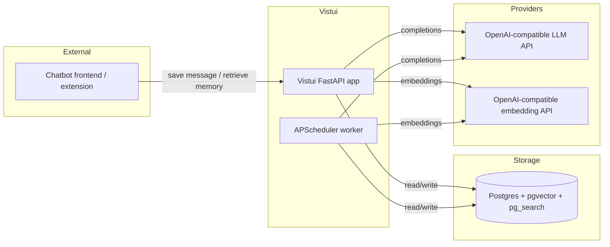

# Vistui Infrastructure Specification

## Purpose

This document describes the infrastructure required to run Vistui as a self-hosted application. It is designed for individuals, not enterprises, and prioritizes simplicity and low operational overhead.

## Scope

- Single-instance deployment.
- Postgres database with `pgvector` and BM25 support.
- FastAPI application process with embedded batch worker.
- Development environment managed via `uv`, `devbox`, `direnv`, `docker`, and `justfile`.

## Architecture overview



Vistui runs as a single Python process. APScheduler is embedded in the same process and uses Postgres as its job store. The database is the only stateful component.

## Components

| Component | Technology | Purpose | Notes |
|-----------|------------|---------|-------|
| Application | Python 3.14, FastAPI, Pydantic, SQLAlchemy | REST API and business logic | Includes embedded APScheduler worker. |
| Batch worker | APScheduler with SQLAlchemyJobStore | Runs embedding, salience, and consolidation jobs | Single worker, graceful stop. |
| Database | Postgres 18 with `pgvector` and `pg_search` | Persistence, vector search, BM25 | ParadeDB image recommended. |
| ORM | SQLAlchemy + Alembic | Schema management and migrations | |
| Testing | pytest, polyfactory, mutmut | Unit, integration, mutation testing | |
| LLM adapter | LangChain or thin OpenAI SDK wrapper | Embeddings and completions | TBD in implementation. |
| Dev environment | uv, devbox, direnv, docker, justfile | Reproducible local setup | |

## Networking

- The FastAPI app listens on a configurable host/port (default `0.0.0.0:8000`).
- Postgres is accessed via a standard `postgresql://` connection string from environment variable `VISTUI_DATABASE_URL`.
- LLM and embedding providers are accessed over HTTP/HTTPS using URLs defined in `providers.yaml`.
- No ingress, load balancer, or service mesh is required for single-instance deployment.

## Identity & security

- No built-in authentication in the first version. The API is assumed to run on a trusted local network or behind the user's own reverse proxy / SSO.
- Provider API keys are stored in environment variables, not in the database.
- The configurable ranking formula is evaluated with `asteval` to limit unsafe operations.
- Postgres credentials are passed via the `VISTUI_DATABASE_URL` environment variable.

## Data & storage

### Postgres extensions

| Extension | Purpose |
|-----------|---------|
| `pgvector` | Vector storage and similarity search. |
| `pg_search` (ParadeDB) | BM25 full-text search. |

### Database objects

- Tables for `users`, `chatgroups`, `chats`, `messages`, `events`, `topics`, `facts`, and join tables.
- `tsvector` columns for BM25 search on memory objects.
- `vector` columns for embedding search.
- Indexes:
  - GIN on `search_vector` columns.
  - IVFFlat or HNSW on `embedding` columns.
  - B-tree on foreign keys and processing state fields.

### Backups

- Self-hoster is responsible for Postgres backups.
- Documented recommendation: daily `pg_dump` or continuous WAL archiving.

## Observability

- Application logs to stdout/stderr in structured JSON format.
- Health check endpoint: `GET /health`.
- Batch status endpoint: `GET /admin/batch/status`.
- No metrics server or tracing in the first version; can be added later.

## Operational concerns

### Scaling

- Horizontal scaling is not a goal for the first version.
- Vertical scaling: increase CPU/memory for the API container and provision a larger Postgres instance.
- If future versions need horizontal scaling, replace embedded APScheduler with a standalone worker queue (e.g., Celery, RQ, arq) backed by Redis or Postgres.

### Failover

- Single-instance deployment; no automatic failover.
- Database backups are the primary recovery mechanism.

### Disaster recovery

- Restore from Postgres backup.
- Recompute missing embeddings if necessary (loss of only the most recent in-flight work is expected).

### Cost controls

- Serial batch worker limits concurrent LLM spend.
- Configurable processing timeout prevents runaway jobs.
- Retrieval only calls LLM for keyword and ratio generation when requested.

## Deployment

### Docker Compose (recommended for self-hosters)

```yaml
services:
  db:
    image: paradedb/paradedb:16
    environment:
      POSTGRES_USER: vistui
      POSTGRES_PASSWORD: ${VISTUI_DB_PASSWORD}
      POSTGRES_DB: vistui
    volumes:
      - vistui_db:/var/lib/postgresql/data

  app:
    build: .
    environment:
      VISTUI_DATABASE_URL: postgresql://vistui:${VISTUI_DB_PASSWORD}@db:5432/vistui
      VISTUI_PROVIDERS_FILE: /config/providers.yaml
      OLLAMA_API_KEY: ${OLLAMA_API_KEY:-}
      REMOTE_API_KEY: ${REMOTE_API_KEY}
    volumes:
      - ./providers.yaml:/config/providers.yaml:ro
    ports:
      - "8000:8000"
    depends_on:
      - db

volumes:
  vistui_db:
```

### Migrations

- Managed with Alembic.
- Run as part of container startup or as a separate init container.

## Development environment

| Tool | Purpose |
|------|---------|
| `uv` | Python dependency management and virtual environment. |
| `devbox` | Declarative development shell (Nix-based). |
| `direnv` | Auto-activate dev environment on entering the project. |
| `docker` | Local Postgres and full-stack testing. |
| `justfile` | Common tasks: `just test`, `just run`, `just migrate`, `just lint`. |

## Risks & dependencies

| Dependency | Risk | Mitigation |
|------------|------|------------|
| ParadeDB `pg_search` | Adds operational complexity compared to plain Postgres. | Provide a pre-built Docker Compose file using the ParadeDB image. |
| APScheduler in-process | Blocks horizontal scaling. | Acceptable for v1; worker abstraction can be swapped later. |
| OpenAI-compatible providers | Provider-specific quirks (timeouts, JSON modes). | Provider adapter handles retries and normalization. |
| Single-instance deployment | No high availability. | Documented as a self-hosted limitation. |

## Rollout plan

1. **Local development:** Docker Compose with ParadeDB image and seed data.
2. **CI pipeline:** pytest + mutmut in GitHub Actions or similar.
3. **Packaging:** Docker image published to a registry.
4. **Documentation:** self-hosting guide with `providers.yaml` template and environment variable reference.

## Open questions

- Should we provide a pure-Postgres fallback without `pg_search` for users who cannot install extensions?
- Should migrations be auto-applied on startup or require a manual step?
- Should the application support running the API and batch worker as separate processes for heavier deployments?

## Changelog

- 2026-07-11: Initial infrastructure specification derived from `startingpoint.md` and discussion.
- 2026-07-11: Applied feedback: frontend terminology, batch worker now includes embedding/salience jobs.
