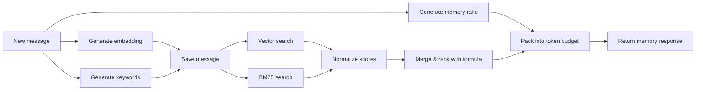

# Vistui Retrieval System

## Context

When a caller sends a new or edited message with `retrieve=true`, Vistui must return the most relevant existing memory (messages, events, topics, facts) without exceeding a token budget. This document describes the retrieval pipeline from ingestion to response packing.

## Goals

1. Return relevant memory within a bounded token budget.
2. Combine vector similarity and BM25 text search for robust matching.
3. Allow per-ChatGroup customization of ranking.
4. Use an LLM-generated memory ratio to balance memory categories per request.
5. Keep retrieval latency low enough for interactive chat use.

## Non-goals

- Perfect recall at any cost.
- Streaming retrieval responses.
- Learning user preferences from click-through feedback.

## Pipeline overview



The embedding, keyword, and memory-ratio generation steps run in parallel after the message text is known.

## Step 1: generate embedding

The message `full_text` is sent to the configured embedding provider (see [`llm-provider.md`](llm-provider.md)).

- The embedding is stored on the `Message` row.
- Reused if the message is edited and the text has not changed; otherwise recomputed.

## Step 2: generate keywords

A configured LLM prompt extracts search keywords from the message. These keywords are stored on the `Message` row and used for BM25 search.

Prompt inputs:

- `full_text`
- `role`
- Optional ChatGroup description for context.

Expected output: a JSON array of lowercase keyword strings, e.g.:

```json
["aria", "first date", "memory"]
```

## Step 3: generate memory ratio

A configured LLM prompt analyzes the message and produces a desired distribution of memory categories for retrieval. Whether this step runs is controlled by the ChatGroup config flag `use_llm_memory_ratio`.

Output shape:

```json
{
  "message": 0.40,
  "event": 0.10,
  "topic": 0.30,
  "fact": 0.20
}
```

The ratio is multiplied by the token budget to compute per-category budgets. Ratios must sum to 1.0 within a small tolerance. If the LLM output does not sum correctly, it is normalized before use.

If `use_llm_memory_ratio` is `false`, or if the LLM call fails, the system falls back to the `memory_ratio` stored in the ChatGroup config.

## Step 4: save the message

The message, embedding, keywords, and salience score are persisted. See [`data-model.md`](data-model.md) and [`api-contract.md`](api-contract.md). The memory ratio is not stored on the message; it is computed on demand during retrieval.

## Step 5: search the memory

Two searches are executed in parallel across the ChatGroup's memory.

### Vector search

Uses `pgvector` cosine similarity over `embedding` columns of Messages, Events, Topics, and Facts.

Search scope:

- **Messages**: only Messages in the same Chat as the new message.
- **Events**: Events in the same Chat.
- **Topics**: Topics linked to the parent ChatGroup.
- **Facts**: Facts linked to the parent ChatGroup.

The query returns top-N candidates per category with a raw vector score (e.g., `1 - cosine_distance`). Candidates without a computed embedding are excluded.

### BM25 text search

Uses the `pg_search` extension over `search_vector` columns.

Search scope is the same as vector search. The query returns top-N candidates per category with a raw BM25 score. Candidates without a computed `search_vector` are excluded.

## Step 6: normalize scores

Before ranking, raw scores are normalized per category to the range `[0, 1]` using the best score in the candidate set for that category and search type.

| Score | Normalization |
|-------|---------------|
| `vector_score` | `raw_vector_score / max_vector_score_in_category` |
| `bm25_score` | `raw_bm25_score / max_bm25_score_in_category` |

This makes heterogeneous search signals comparable and allows the ranking formula to combine them meaningfully.

No recency, message role, or other signals are used unless explicitly added by the user in the custom formula.

## Step 7: merge and rank

For each candidate, compute a final relevance score using the ChatGroup's configurable `ranking_formula`.

### Default formula

```python
lambda vector_score, bm25_score, salience, linked_count: max(
    vector_score * salience * linked_count,
    bm25_score * salience * linked_count
)
```

### Inputs to the formula

| Variable | Meaning |
|----------|---------|
| `vector_score` | Normalized vector similarity score for the candidate. |
| `bm25_score` | Normalized BM25 score for the candidate. |
| `salience` | Candidate's stored salience score. |
| `linked_count` | Number of messages linked to the candidate (events, topics, facts) or 1 for raw messages. |

### Formula evaluation

- The formula is stored as a Python lambda string on the `ChatGroup`.
- It is evaluated using `asteval` with no builtins and no imports allowed.
- The evaluator is instantiated per call; no persistent interpreter state leaks between calls.
- If evaluation fails, retrieval falls back to the system default formula and logs a warning.

## Step 8: pack into token budget

Given:

- Total token budget (`token_budget` from query param or ChatGroup default).
- Per-category budgets (`memory_ratio * token_budget`).
- Sorted candidates per category by relevance.

Packing algorithm:

1. For each category in the order `fact`, `topic`, `event`, `message`:
   1. Take candidates in descending relevance order.
   2. Estimate tokens for the candidate `full_text`.
   3. If the candidate fits in the remaining category budget, add it.
   4. Stop when the category budget is exhausted.
2. Sum used tokens per category.

### Token estimation

Use a simple whitespace / punctuation tokenizer. The estimate is intentionally approximate; callers may re-tokenize with their own model tokenizer.

## Step 9: return memory response

The API returns a `memory` block as defined in [`api-contract.md`](api-contract.md), containing metadata about the budget, the memory ratio, and a list of memory items.

## Performance targets

| Metric | Target | Notes |
|--------|--------|-------|
| Retrieval latency (no LLM) | < 200 ms p95 | Embedding + search + packing. |
| Retrieval latency (with LLM keywords/ratio) | < 2 s p95 | Depends on LLM provider. |
| Candidate pool size per category | 100 | Configurable via ChatGroup. |

## Failure handling

- If embedding generation fails: return an error; the message cannot be retrieved.
- If keyword generation fails: use empty keywords and continue.
- If memory ratio generation fails: fall back to the ChatGroup `memory_ratio` and continue.
- If formula evaluation fails: fall back to default formula.
- If vector or BM25 search fails partially: return results from the other search and log a warning.

## Changelog

- 2026-07-11: Initial retrieval system design derived from `startingpoint.md` and discussion.
- 2026-07-11: Applied feedback: score normalization documented before ranking formula, removed optional budget redistribution, removed open questions, memory ratio is generated by LLM or taken from ChatGroup config.
