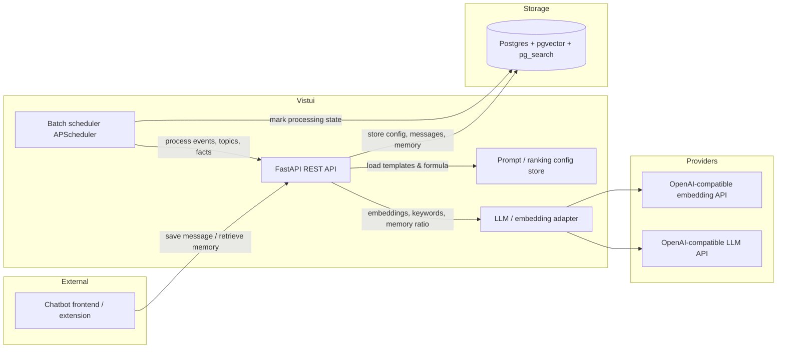

# Vistui System Overview

## Context

Vistui ("for knowledge" in old gaulish) is a self-hosted REST API that stores and retrieves memory from long-running conversations with chatbots. It is primarily intended for roleplay chats, but is kept use-case agnostic and frontend-agnostic: any chatbot frontend (SillyTavern, OpenWebUI, etc.) can integrate via extensions or MCP servers as long as they send data in the expected format.

The core insight is that perfect, immediate memory consolidation is not required. Modern chatbots already have a large context window for recent history. Vistui therefore uses asynchronous batch jobs to consolidate older messages into richer memory structures (events, topics, facts) during periods of low activity. This trades strict consistency for simplicity, cost, and self-hosting friendliness.

This document is the entry point to the architecture. Related documents:

- [`data-model.md`](data-model.md)
- [`api-contract.md`](api-contract.md)
- [`retrieval-system.md`](retrieval-system.md)
- [`batch-consolidation.md`](batch-consolidation.md)
- [`llm-provider.md`](llm-provider.md)
- [`infrastructure.md`](infrastructure.md)

## Goals

1. Provide a persistent memory layer for long chat sessions.
2. Retrieve relevant context quickly and cheaply for each new message.
3. Consolidate raw messages into structured memory (events, topics, facts) asynchronously.
4. Stay frontend-agnostic: the API does not know about specific chatbot implementations.
5. Keep the system simple enough to be self-hosted by individuals.
6. Allow heavy customization of prompts, ranking, and memory behavior per ChatGroup.

## Non-goals

- Real-time collaborative editing.
- Enterprise multi-tenant scaling or strict SLAs.
- Built-in frontend or chat UI.
- Guaranteed immediate consistency of memory after every message.
- Moving a Chat from one ChatGroup to another.

## Users / Actors

| Actor | Role |
|-------|------|
| **End user** | The person chatting with an AI companion or chatbot. They indirectly benefit from memory. |
| **Frontend / extension** | A chatbot frontend (SillyTavern, OpenWebUI, custom client) or MCP server that calls Vistui. This is the real API consumer. |
| **Admin / self-hoster** | The individual deploying and configuring the Vistui instance and LLM providers. |

## Architecture overview

### High-level data flow

1. The frontend/extension sends a new or edited message to Vistui with a `retrieve` flag.
2. Vistui persists the message, computes its embedding and search keywords, and determines a memory ratio for retrieval (either via LLM or from ChatGroup config).
3. If retrieval is requested, Vistui searches its memory (messages, events, topics, facts) using vector + BM25 search, ranks results, and packs them into a token-budgeted response.
4. During idle periods, a single background worker processes older messages and consolidates them into events, topics, and facts. It also ensures embeddings and salience scores are computed for all messages.

## Functional requirements

1. **FR-1:** The API shall allow creation and management of Users, ChatGroups, Chats, and Messages.
2. **FR-2:** Messages shall be stored in a linked list within a Chat.
3. **FR-3:** Message edits shall overwrite the existing message in place and recompute its embedding.
4. **FR-4:** A Chat shall be assigned to exactly one ChatGroup for its entire lifetime.
5. **FR-5:** A Chat not assigned to a ChatGroup shall trigger creation of a dedicated ChatGroup with matching name and description.
6. **FR-6:** The API shall optionally return relevant memory for a new/edited message when requested.
7. **FR-7:** Memory retrieval shall support vector search, BM25 text search, and a configurable ranking formula.
8. **FR-8:** Returned memory shall respect a caller-provided token budget and a memory ratio, generated by LLM or taken from ChatGroup config.
9. **FR-9:** The system shall run asynchronous batch jobs to compute missing embeddings and salience scores.
10. **FR-10:** The system shall run asynchronous batch jobs to consolidate messages into events, topics, and facts, but only after embeddings and salience are computed.
11. **FR-11:** Batch jobs shall start after a period of inactivity, pause on new activity, and resume on restart.
12. **FR-12:** LLM prompts, ranking formula, and core config shall be stored per ChatGroup and inherited from system defaults at creation.
13. **FR-13:** The system shall support multiple OpenAI-compatible providers for embeddings and LLM calls.

## Constraints & assumptions

- Self-hosted by individuals, not enterprise.
- LLM calls are rate-limited and relatively expensive; batch work is serialized through a single worker.
- Embedding and LLM providers are OpenAI-compatible and configured in a YAML file with secrets in environment variables.
- Postgres must support both `pgvector` and a BM25 extension (e.g., ParadeDB `pg_search`).
- Message IDs are generated by the caller (UUID), enabling idempotent `PUT` semantics.
- The `x` most recent messages in a Chat are never consolidated into events/topics/facts, protecting against edits and rerolls. They still receive embeddings and salience scores.

## Risks & trade-offs

| Risk | Mitigation |
|------|------------|
| Edited messages leave downstream memory stale | Only the most recent `x` messages are excluded from consolidation; older edits are accepted as a limitation. |
| Configurable ranking lambda could be unsafe | Evaluated with `asteval` to restrict dangerous operations while keeping flexibility. |
| Single worker limits throughput | Acceptable for self-hosted scope; design allows replacing APScheduler with a queue later. |
| `pg_search` adds deployment complexity | Documented; ParadeDB image recommended. |
| Long-running batch jobs may be interrupted | Jobs mark per-message processing state and resume on restart. |

## Rollout plan

1. **Phase 1:** Core entities, API, Postgres schema, basic message CRUD.
2. **Phase 2:** Embedding, keyword generation, memory ratio, and retrieval pipeline.
3. **Phase 3:** Batch embedding/salience jobs and batch consolidation (event, topic, fact).
4. **Phase 4:** Configurable prompts, ranking formula, and ChatGroup tuning.
5. **Phase 5:** Provider configuration file, dev environment, and packaging.

## Open questions

- Exact default values for ChatGroup configuration (token budget, memory ratio, protected message count, thresholds, timeouts).
- Whether event consolidation should also be scoped to ChatGroup or strictly per Chat.
- Initial set of system default prompt templates.

## Changelog

- 2026-07-11: Initial architecture document derived from `startingpoint.md` and discussion.
- 2026-07-11: Applied feedback: frontend terminology, memory ratio is generated by LLM or taken from ChatGroup config, embedding/salience as prerequisite batch pipelines.
